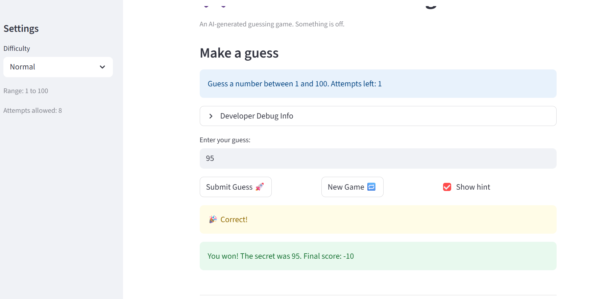

# 🎮 Game Glitch Investigator: The Impossible Guesser

## 🚨 The Situation

You asked an AI to build a simple "Number Guessing Game" using Streamlit.
It wrote the code, ran away, and now the game is unplayable. 

- You can't win.
- The hints lie to you.
- The secret number seems to have commitment issues.

## 🛠️ Setup

1. Install dependencies: `pip install -r requirements.txt`
2. Run the broken app: `python -m streamlit run app.py`

## 🕵️‍♂️ Your Mission

1. **Play the game.** Open the "Developer Debug Info" tab in the app to see the secret number. Try to win.
2. **Find the State Bug.** Why does the secret number change every time you click "Submit"? Ask ChatGPT: *"How do I keep a variable from resetting in Streamlit when I click a button?"*
3. **Fix the Logic.** The hints ("Higher/Lower") are wrong. Fix them.
4. **Refactor & Test.** - Move the logic into `logic_utils.py`.
   - Run `pytest` in your terminal.
   - Keep fixing until all tests pass!

## 📝 Document Your Experience

- [ ] Describe the game's purpose.
- This is a number guessing game built with Streamlit. he player selects a difficulty level (Easy, Normal, or Hard), each of which defines a range and a maximum number of allowed attempts. The game picks a secret number within that range, and the player must guess it. After each guess, the game gives a hint ("Go Higher" or "Go Lower") and update a score. The goal is to guess the secret number before running out of attempts. 

- [ ] Detail which bugs you found.
- Bug 1: The "Too High" and "Too Low" outcome labels are swapped relative to the hint messages shown to the player. When the player's guess is greater than the secret, the game should say "Go LOWER", not "Go HIGHER". Every hint was the opposite of what it should be, making the game unwinnable by following the feedback.
- Bug 2: The "New Game" button hardcodes random.randint(1, 100) instead of using the low and high values derived from the selected difficulty. This meant Easy mode (range 1–20) and Hard mode (range 1–50) would still produce secrets like 68 or 87, making difficulty settings meaningless.
- Bug 3: After a win or loss, the new_game block generates a fresh secret but never resets st.session_state.status back to "playing". The st.stop() guard fires immediately on every subsequent guess, making the new game unplayable.

- [ ] Explain what fixes you applied.
Fix for Bug 1: Swapped hint messages so "Go Lower" fires whe guess is too high
For for Bug 2: Changed randint(1, 100) to randint(low, high)
Fix for Bug 3: Added reset for status, attempts, score, and history

## 📸 Demo

- [ ] [Insert a screenshot of your fixed, winning game here]

## 🚀 Stretch Features

- [ ] [If you choose to complete Challenge 4, insert a screenshot of your Enhanced Game UI here]
